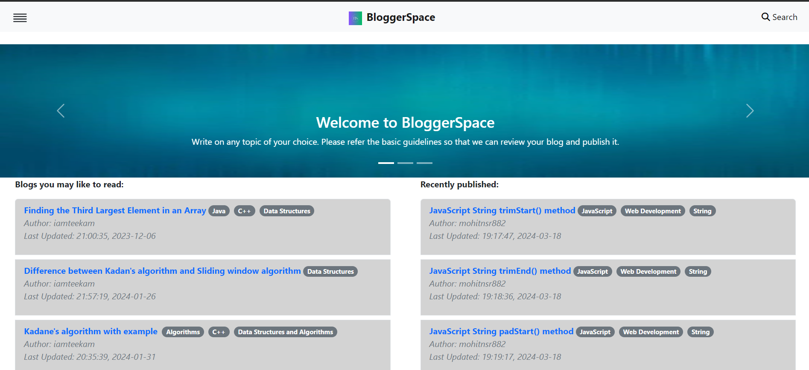

# BloggerSpace

A full-stack blogging platform where every post is reviewed by a real human before it goes live. Writers submit drafts, reviewers give structured feedback, and admins publish — no bots, no AI scoring.

**Live site:** [bloggerspace.singhteekam.in](https://bloggerspace.singhteekam.in/)  
**Community:** [bloggerspace.singhteekam.in/community](https://bloggerspace.singhteekam.in/community)

> 150+ blogs already ranked on Google Search.

---

## Tech Stack

| Layer | Technology |
|---|---|
| Frontend | Next.js 16 (App Router), React 19, TypeScript |
| Styling | Tailwind CSS v4, Radix UI primitives, shadcn/ui |
| Editor | TipTap (ProseMirror) with AI generation |
| State / Data | TanStack React Query, React Context |
| Backend | Node.js, Express.js |
| Database | MongoDB + Mongoose |
| Auth | JWT (access + refresh tokens), Firebase Auth (Google OAuth) |
| Email | Nodemailer |
| Storage | GitHub raw CDN for user-uploaded images |
| Deployment | Vercel (frontend), self-hosted VPS (backend) |
| Analytics | Vercel Analytics + Speed Insights |

---

## Features

### For Readers
- Browse all published blogs with category and tag filtering (dropdowns)
- Full-text blog reading — rich formatting, code blocks, images
- Save blogs to a personal reading list
- Real-time blog view count
- Like any blog (verified accounts only)
- Search published blogs
- View any user's public profile
- Community discussion board with threaded replies

### For Writers
- Rich TipTap editor — markdown, headings, code blocks, images, links
- AI-assisted content generation (enter a title, get a first draft)
- Auto-save drafts every 30 seconds
- Preview before submitting
- Submit for human review; receive structured feedback via email
- Track every blog through its full review lifecycle:
  `Draft → Pending Review → Under Review → Awaiting Revision → Published`
- Email notifications at each key stage
- Edit and resubmit after reviewer feedback

### For Reviewers
- Dedicated dashboard with assigned blogs
- Inline content editing (title, category, tags, body)
- Star rating + written remarks before forwarding to admin
- Send revision requests directly back to the author
- Save review drafts; pick up later

### For Admins
- Publish or discard any user-submitted blog
- Write and publish admin-authored blogs directly (with draft support)
- Approve or remove reviewer accounts
- Manage all registered users (soft-delete)
- Full visibility into every blog at every status stage
- Edit any blog before publishing

### Platform
- Sign up with email/password or Google (Firebase OAuth)
- Email verification for new accounts
- Forgot password / reset password flow
- Change password and username from profile settings
- Delete account
- Follow and unfollow users
- Writing guidelines page
- Sitemap (`/sitemap.xml`)
- Fully responsive and mobile-friendly
- SEO-optimised (per-page metadata, Open Graph, JSON-LD structured data)
- Community posts — no review required, instantly published

---

## Folder Structure

```
MyBlogWebsite/
│
├── bloggerspace-next/       # ✅ Active frontend — Next.js 16 (App Router)
│   ├── public/              # Static assets (logo, user photos, OG images)
│   └── src/
│       ├── app/             # Pages, layouts, API routes (App Router)
│       ├── components/      # UI — brand, layout, editor, blog, animated, ui/
│       ├── contexts/        # Auth context
│       ├── data/            # Static JSON (categories, tags)
│       ├── hooks/           # Custom hooks (useAutoSave, useRequireAuth, …)
│       ├── lib/             # API clients, utilities, constants, JSON-LD
│       └── types/           # TypeScript types
│
├── server/                  # Express.js + MongoDB backend (API)
│   ├── controllers/
│   │   ├── Admin/
│   │   ├── Reviewer/
│   │   ├── blogsController.js
│   │   ├── communityController.js
│   │   └── userscontroller.js
│   ├── db/
│   ├── middlewares/         # Auth, role guards, logging
│   ├── models/              # Mongoose schemas
│   ├── routes/
│   ├── services/
│   └── utils/
│
├── client/                  # Legacy React frontend (replaced by bloggerspace-next)
│
├── package.json
└── README.md                # ← you are here
```

---

## Getting Started (Local Development)

### Prerequisites
- Node.js ≥ 20
- MongoDB (local or Atlas)

### 1 — Clone

```bash
git clone https://github.com/singhteekam/BloggerSpace.git
cd BloggerSpace
```

### 2 — Start the backend

```bash
cd server
npm install
npm run dev        # starts on http://localhost:5000
```

Create `server/.env`:

```env
PORT=5000
MONGO_URI=mongodb://localhost:27017/bloggerspace

JWT_SECRET=your_jwt_secret
JWT_REFRESH_SECRET=your_refresh_secret

EMAIL_USER=your_email@gmail.com
EMAIL_PASS=your_app_password

# Firebase Admin SDK (Google OAuth)
FIREBASE_PROJECT_ID=...
FIREBASE_CLIENT_EMAIL=...
FIREBASE_PRIVATE_KEY=...
```

### 3 — Start the frontend

```bash
cd bloggerspace-next
npm install
npm run dev        # starts on http://localhost:3000
```

Create `bloggerspace-next/.env.local`:

```env
NEXT_PUBLIC_API_URL=http://localhost:5000
NEXT_PUBLIC_FRONTEND_URL=http://localhost:3000
```

---

## Deployment

### Frontend → Vercel
1. Push to GitHub.
2. Import `bloggerspace-next/` as the root directory in [vercel.com/new](https://vercel.com/new).
3. Set `NEXT_PUBLIC_API_URL` and `NEXT_PUBLIC_FRONTEND_URL` in Vercel environment variables.
4. Deploy — auto-deploys on every push to `main`.

### Backend → VPS / Railway / Render
Deploy the `server/` directory to any Node.js host with the `.env` variables above.

---

## Screenshots



---

## Developer

**Teekam Singh**  
[singhteekam.in](https://www.singhteekam.in/) · [GitHub](https://github.com/singhteekam) · [LinkedIn](https://in.linkedin.com/in/singhteekam)

---

## Contributing

Contributions, issues, and feature requests are welcome. Please try the site and share your feedback — it genuinely helps improve the platform.

