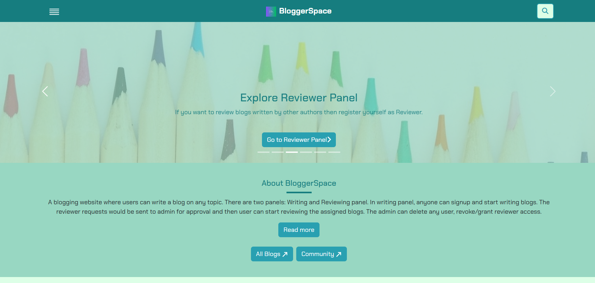

# BloggerSpace
Tech Stack: MERN stack
 - A blogging website where users can write a blog on any topic. 
 - There are two panels: Writing and Reviewing panel. In
 writing panel, anyone can signup and start writing blogs.
 - The reviewer requests would be sent to admin for approval and then user can start reviewing the assigned blogs. The admin can delete any user, revoke/grant reviewer access.

 - Used nodemailer API to send emails. Ex: Email will be sent when the blog is under review, discarded, published.
 - Review stages: Pending for Review-Under review-In Review-Awaiting author (if need modification)-Publish
Please try and give me the feedback. Your valuable feedback will help me to improve this website.
- 80+ blogs are already ranked on Google search.

### Link: [https://bloggerspace.singhteekam.in](https://bloggerspace.singhteekam.in/)

### BloggerSpace Reviewer Panel: [https://reviewbloggerspace.singhteekam.in](https://reviewbloggerspace.singhteekam.in/)

### BloggerSpace community: [https://bloggerspace.singhteekam.in/community](https://bloggerspace.singhteekam.in/community)

## Features
- View all published blogs
- Create new blog
- save as draft the blog
- Real time blog views count
- Comments and Reply on the comments
- Share blog on most famous social media platforms
- Count number of visitor who visited the website.
- Login/Sign up with Email and password
- Sign in with Google
- Forgot password page
- Change password
- Delete Account
- Change username
- View public profile of any user
- Email verification for new users(except Sign in with Google)
- Review stages:
    - Pending for Review
    - Under review
    - In Review
    - Awaiting author (if need modification)
    - Publish
- Mail sent when:
    - blog is submitted for review
    - blog status is moved to awaiting author
    - blog is published
- Like any blog (user should be loggged in and verified account)
- Save any blog for read later
- Search any published blog
- Writing Guidelines for writing the blog
- Preview the blog before submitting for review
- Sitemap
- Responsive
- SEO friendly
- Follow and Unfollow users
- Community for bloggers to interactive with each other
- No review process for community posts. Instantly published after submitting the post.


#### Folder structure:
```
├── client
│   ├── public
│   ├── src
│   │   ├── components
│   │   ├── utils
│   ├── App.css
│   ├── App.js
│   ├── index.css
│   ├── index.js
│   ├── package.json
│   ├── package-lock.json
│   ├── .gitignore
├── server
│   ├── controllers
│   │   ├── Admin
│   │   ├── Reviewer
│   │   ├── blogController.js
│   │   ├── communityController.js
│   │   └── userscontroller.js
│   ├── db
│   │   └── db.js
│   ├── middlewares
│   ├── models
│   ├── routes
│   ├── services
│   ├── utils
│   ├── .env
│   ├── node_modules
│   ├── package.json
│   └── package-lock.json
├── package.json
├── package-lock.json  
├── .gitignore  
└── README.md
```

#### BloggerSpace Homepage


## Contributing

Contributions are always welcome!